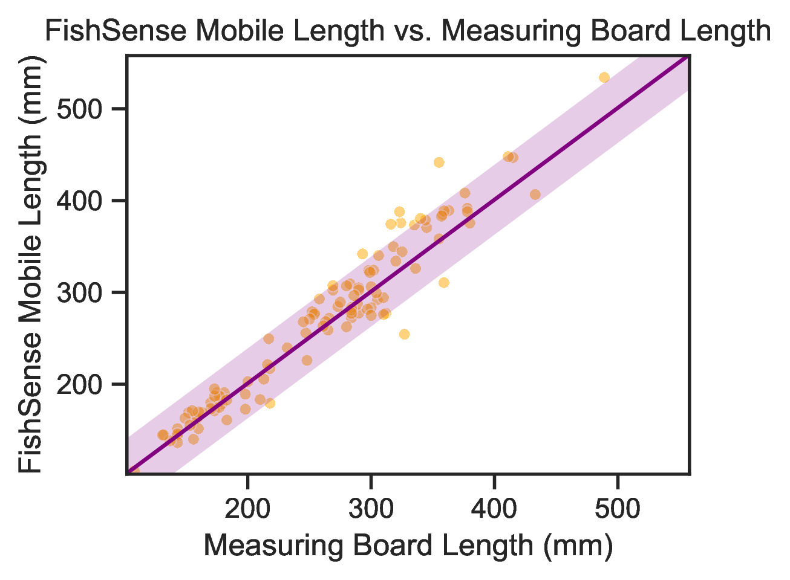
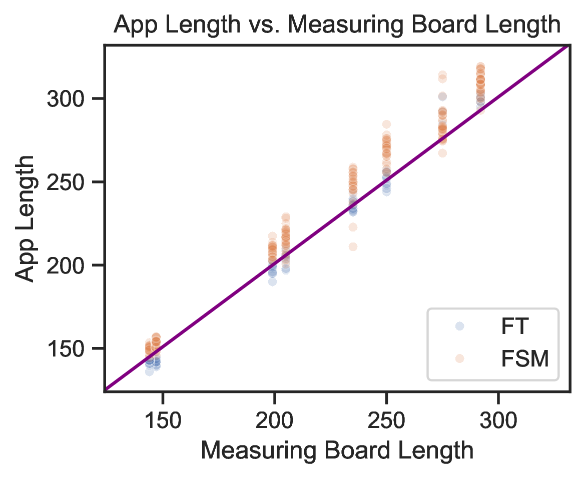

# FishSense Mobile: A Mobile Device App for On-Deck Fisheries Management Operations

## Repo
The source code for the App can be found on GitHub here: [UCSD-E4E/fishsense-mobile](https://github.com/UCSD-E4E/fishsense-mobile).

## Results
The figure below is based off of length measurements collected on multiple CCFRP cruises off the coast of San Diego.  Here, we compare the results collected by FishSense Mobile to the length board measurements. This has an $R^2=0.994$ indicating high correlation to the length board measurements.

The figure below compares FishSense Mobile to another citizen science app called Fishtechy ([fishtechy.com](https://fishtechy.com/)).  Here FishSense Mobile is in orange and FishTechy is in blue.

## Paper
More details can be found in our paper, which you can read here: [FishSense Mobile: A Mobile Device App for On-Deck Fisheries Management Operations](paper.pdf).

## Demo Video

## Presentation
You can download the conference presentation here: [FishSense Mobile: A Mobile Device App for On-Deck Fisheries Management Operations](presentation.pptx)